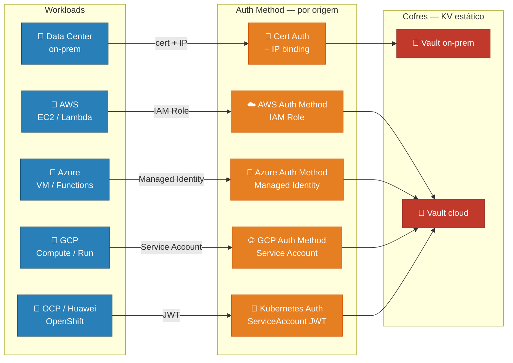
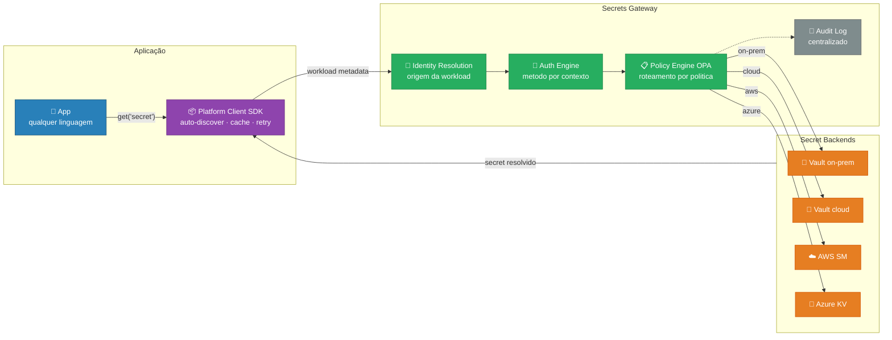

<h1 align="center">PAM Moderno — Evolução por Camadas</h1>

<p align="center">
  
  
  
  
</p>

<p align="center">
  De múltiplos cofres isolados com autenticação por ambiente<br>
  até uma <strong>plataforma interna de segredos</strong> com interface única para o desenvolvedor.
</p>

---

Toda aplicação precisa de segredos para funcionar: senhas de banco de dados, chaves de API, certificados. A forma como esses segredos são armazenados, distribuídos e consumidos define o nível de segurança e o atrito que o desenvolvedor enfrenta no dia a dia.

**PAM (Privileged Access Management)** é a disciplina que cuida exatamente disso — garantir que apenas quem deve ter acesso a um segredo consiga obtê-lo, de forma rastreável e controlada.

Este projeto documenta uma jornada de modernização do PAM em camadas progressivas. O ponto de partida é um cenário real e comum: workloads distribuídas entre o Data Center local e múltiplas clouds — AWS, Azure, GCP, Huawei, OCP e outras — cada uma com seu próprio método de autenticação e, muitas vezes, seu próprio cofre. O destino é uma **estratégia de plataforma**: uma camada de abstração que permite ao desenvolvedor consumir qualquer segredo de qualquer ambiente através de uma interface única, sem precisar conhecer o vendor, a cloud ou o protocolo de autenticação por trás.

> [!IMPORTANT]
> O objetivo central não é apenas segurança — é **reduzir o atrito**. Uma plataforma bem construída torna o caminho seguro o caminho mais fácil.

---

## 📊 Visão Comparativa

| | AS-IS | TO-BE |
|---|---|---|
| **Autenticação** | Por ambiente — cert+IP, IAM Role, Managed Identity... | Automática via metadata da workload |
| **Cofres** | 2 isolados — on-prem e cloud | N backends unificados atrás de uma API |
| **Dev experience** | SDK por vendor + configuração manual | `SecretsClient().get("secret")` |
| **Governança** | Auditoria separada por cofre | Centralizada via OPA + Audit Log |
| **Portabilidade** | Migrar de cloud = reescrever auth | Zero mudança de código |

---

## 🗺️ Arquitetura

### AS-IS — Baseline atual



No cenário atual, cada ambiente onde uma aplicação pode rodar tem sua própria forma de provar identidade para o cofre de segredos. Uma aplicação rodando no Data Center local apresenta um certificado digital junto com seu endereço IP. A mesma aplicação rodando na AWS usa um IAM Role — uma identidade gerenciada pela própria Amazon. Na Azure, usa Managed Identity. No GCP, uma Service Account. Em ambientes Kubernetes como OCP ou Huawei Cloud, um token JWT emitido pelo cluster.

O resultado prático é que o desenvolvedor que precisa consumir um segredo — seja uma senha de banco, uma chave de API ou um certificado — precisa primeiro entender em qual ambiente sua aplicação está rodando, qual método de autenticação aquele ambiente exige, qual dos cofres deve ser consultado e como configurar tudo isso no código. Esse conhecimento é específico de infraestrutura e não tem relação com o problema de negócio que o desenvolvedor está resolvendo.

> [!CAUTION]
> **Problemas desta camada:**
> - ❌ Cada cloud tem sua própria engine de auth — o desenvolvedor precisa conhecer o método correto para cada origem
> - ❌ Migrar ou replicar uma workload entre ambientes exige reescrever a autenticação
> - ❌ Dois cofres com governança e auditoria separadas — sem visão unificada de acesso
> - ❌ Credenciais estáticas nos dois KVs — sem expiração automática
> - ❌ Escalar para novas clouds (Huawei, OCI, etc.) significa adicionar mais um método de auth e mais complexidade

---

### TO-BE — Visão Target

> [!TIP]
> **Padrão: Platform Engineering + Secrets Gateway**
>
> A proposta introduz dois componentes que juntos formam uma plataforma interna de segredos:
>
> - **Platform Client SDK** — biblioteca embutida na aplicação que implementa o padrão *Credential Provider Chain* (estabelecido pelo AWS SDK e GCP ADC): auto-detecta o contexto de execução via APIs de metadados nativas de cada cloud, sem nenhuma configuração de autenticação no código.
>
> - **Secrets Gateway** — serviço centralizado que atua como proxy autenticado para todos os backends de segredos. Concentra em um único ponto: resolução de identidade, seleção dinâmica de auth method, roteamento por política (OPA) e auditoria unificada.

**Interface do desenvolvedor — antes e depois:**

```python
# ❌ ANTES — o desenvolvedor conhece vault, método, path e credenciais
import hvac
client = hvac.Client(url="https://vault-onprem:8200")
client.auth.cert.login(cert_pem=open("cert.pem").read())
secret = client.secrets.kv.read_secret("app/db/password")

# ✅ DEPOIS — uma linha agnóstica a vendor, cloud e método de auth
from platform_sdk import SecretsClient
secret = SecretsClient().get("app/db/password")
```



**Fluxo detalhado:**

| Passo | Componente | Ação |
|---|---|---|
| 1 | App | Chama `client.get("nome")` — uma única linha sem configuração de auth |
| 2 | Platform Client SDK | Coleta metadados do ambiente: cloud provider, região, instance ID, namespace, ServiceAccount token, certificado local |
| 3 | Platform Client SDK | Envia os metadados ao Secrets Gateway junto com a requisição |
| 4 | **Identity Resolution** | Gateway determina a identidade da workload a partir dos metadados |
| 5 | **Auth Engine** | Seleciona e executa o método de autenticação correto para o backend alvo (cert auth, IAM Role, Managed Identity, K8s JWT) |
| 6 | **Policy Engine (OPA)** | Avalia as regras de roteamento: qual backend, qual path, qual compliance se aplica |
| 7 | Secrets Gateway | Busca o segredo no backend correto e registra no audit log centralizado |
| 8 | Platform Client SDK | Entrega o valor ao app — transparente, portável, sem acoplamento a vendor |

**Referências de mercado:**

| Componente | Padrão de mercado |
|---|---|
| Platform Client SDK | AWS Credential Provider Chain · GCP Application Default Credentials |
| Secrets Gateway | Dapr Secrets Building Block · Vault Agent Injector |
| Policy Engine | Open Policy Agent (OPA) |
| Identity Resolution | SPIFFE/SPIRE · Cloud Workload Identity |
| Sidecar como alternativa | Dapr · Envoy · Vault Agent (para evitar lib por linguagem) |

---

## 🛠️ Stack técnica

| Componente | Tecnologia | Papel |
|------------|-----------|-------|
| Aplicação | Python 3.12+ | Workload consumidora de segredos |
| Platform Client SDK | Python (pip) / Go / Java | Interface do desenvolvedor — auto-discover e cache |
| Secrets Gateway | Go / Python (serviço próprio) | Proxy central de autenticação e roteamento |
| Policy Engine | Open Policy Agent (OPA) | Roteamento declarativo por política |
| Secret Backends | HashiCorp Vault OSS, AWS SM, Azure KV | Armazenamento efetivo dos segredos |
| Identity Resolution | Cloud Metadata APIs + K8s Downward API | Detecção automática do contexto da workload |
| Orquestração | Kubernetes (Minikube) | Plataforma de execução dos labs |
| Observabilidade | Vault Audit Log + OPA Decision Log + SIEM | Rastreabilidade centralizada |

---

## 📚 Referências

### 🔐 Padrões de Autenticação e Identidade

- [AWS Credential Provider Chain](https://docs.aws.amazon.com/sdkref/latest/guide/standardized-credentials.html) — modelo de descoberta automática de credenciais que inspirou o design do Platform Client SDK
- [GCP Application Default Credentials (ADC)](https://cloud.google.com/docs/authentication/application-default-credentials) — equivalente GCP ao Credential Provider Chain
- [Azure Managed Identity](https://learn.microsoft.com/en-us/entra/identity/managed-identities-azure-resources/overview) — identidade de workload nativa da Azure
- [SPIFFE / SPIRE](https://spiffe.io/) — padrão aberto de identidade para workloads, base para o conceito de Identity Resolution
- [Kubernetes Auth Method — Vault](https://developer.hashicorp.com/vault/docs/auth/kubernetes) — autenticação via ServiceAccount JWT

### 🗄️ Secrets Management

- [HashiCorp Vault](https://developer.hashicorp.com/vault/docs) — cofre de segredos, base da arquitetura AS-IS e backend no TO-BE
- [AWS Secrets Manager](https://docs.aws.amazon.com/secretsmanager/latest/userguide/intro.html) — secrets manager nativo da AWS
- [Azure Key Vault](https://learn.microsoft.com/en-us/azure/key-vault/general/overview) — cofre de segredos nativo da Azure
- [Vault Dynamic Secrets](https://developer.hashicorp.com/vault/tutorials/db-credentials/database-secrets) — geração de credenciais efêmeras com TTL

### 🏗️ Platform Engineering e Abstração

- [Dapr Secrets Building Block](https://docs.dapr.io/developing-applications/building-blocks/secrets/secrets-overview/) — referência de mercado para abstração de secrets via sidecar
- [Vault Agent Injector](https://developer.hashicorp.com/vault/docs/platform/k8s/injector) — injeção automática de segredos em pods Kubernetes
- [Internal Developer Platform (IDP)](https://internaldeveloperplatform.org/) — conceito de plataforma interna que reduz o atrito do desenvolvedor

### 📋 Policy Engine

- [Open Policy Agent (OPA)](https://www.openpolicyagent.org/docs/latest/) — motor de política declarativa usado no roteamento semântico do Secrets Gateway
- [OPA Rego Language](https://www.openpolicyagent.org/docs/latest/policy-language/) — linguagem de políticas do OPA

### 🧭 Conceitos e Arquitetura

- [PAM Fabric](https://www.cyberark.com/what-is/pam/) — evolução do PAM tradicional para um modelo distribuído e integrado
- [Zero Standing Privileges (ZSP)](https://www.crowdstrike.com/cybersecurity-101/zero-standing-privileges/) — eliminação de acessos privilegiados permanentes
- [Platform Engineering](https://platformengineering.org/blog/what-is-platform-engineering) — disciplina de construção de plataformas internas para reduzir fricção de desenvolvedores
